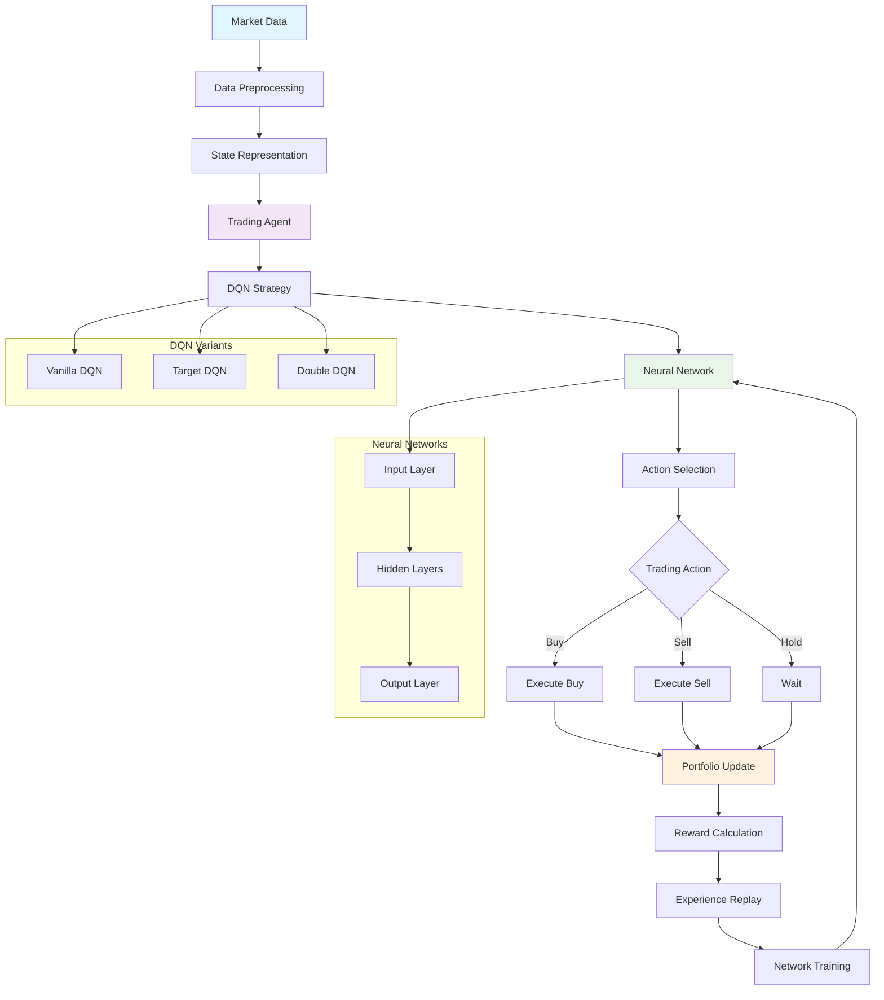

# Quantsphere Architecture Diagram

```mermaid
graph TB
    A[Market Data] --> B[Data Preprocessing]
    B --> C[State Representation]
    C --> D[Trading Agent]
    
    D --> E[DQN Strategy]
    E --> F[Neural Network]
    F --> G[Action Selection]
    
    G --> H{Trading Action}
    H -->|Buy| I[Execute Buy]
    H -->|Sell| J[Execute Sell]
    H -->|Hold| K[Wait]
    
    I --> L[Portfolio Update]
    J --> L
    K --> L
    
    L --> M[Reward Calculation]
    M --> N[Experience Replay]
    N --> O[Network Training]
    O --> F
    
    subgraph "DQN Variants"
        P[Vanilla DQN]
        Q[Target DQN]
        R[Double DQN]
    end
    
    E --> P
    E --> Q
    E --> R
    
    subgraph "Neural Networks"
        S[Input Layer]
        T[Hidden Layers]
        U[Output Layer]
    end
    
    F --> S
    S --> T
    T --> U
    
    style A fill:#e1f5fe
    style D fill:#f3e5f5
    style F fill:#e8f5e8
    style L fill:#fff3e0
```
